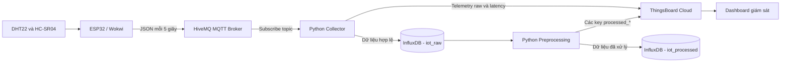

# Sơ đồ kiến trúc hệ thống

## Mô tả các khối

1. **Lớp cảm biến:** DHT22 đo nhiệt độ, độ ẩm; HC-SR04 đo khoảng cách.
2. **Lớp thiết bị:** ESP32 đọc cảm biến, bổ sung mã thiết bị, sequence, boot ID,
   RSSI, uptime và timestamp rồi đóng gói JSON.
3. **Lớp truyền thông:** ESP32 publish lên topic
   `ptit/int14149/b23dcat250/telemetry` tại HiveMQ bằng MQTT.
4. **Lớp thu thập:** Python Collector subscribe topic, validate kiểu dữ liệu và miền
   giá trị, phát hiện bản tin trùng, ghi InfluxDB và forward lên ThingsBoard.
5. **Lớp lưu trữ:** InfluxDB lưu dữ liệu raw, dữ liệu đã xử lý và metric hiệu năng.
6. **Lớp xử lý:** chương trình preprocessing làm sạch, xử lý outlier, nội suy,
   resampling, chuẩn hóa và tạo đặc trưng.
7. **Lớp hiển thị:** ThingsBoard hiển thị dữ liệu raw real-time, dữ liệu processed
   và độ trễ.

## Luồng dữ liệu

ESP32 gửi một bản tin JSON mỗi 5 giây. Collector chỉ ghi các bản tin vượt qua bước
validate. Dữ liệu raw được giữ 7 ngày. Khi chạy preprocessing, dữ liệu được đọc theo
khoảng thời gian, xử lý riêng theo từng thiết bị và ghi sang bucket có retention 30
ngày. Cả dữ liệu raw và processed đều được chuyển lên ThingsBoard để giám sát.

